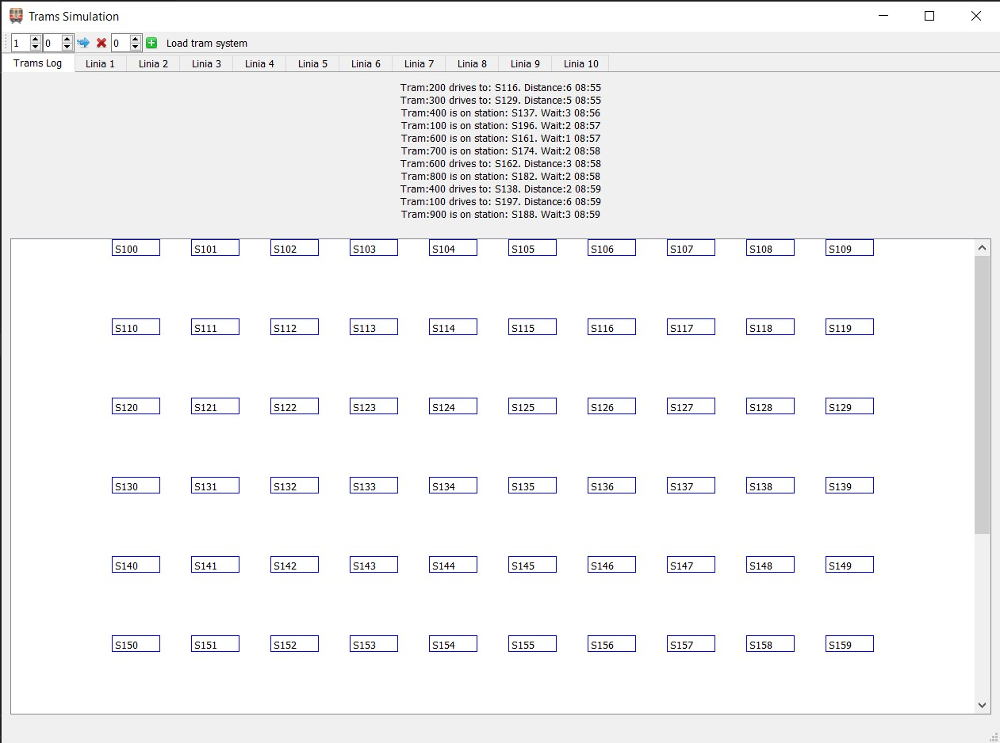

# Simple-Tram-Simulator

### Task: 
Create simple Simulator of Urban Tram System

### Requirements: 
1. Simulator has to imitate work of many trams according to a timetable
2. Tram system consists of many stops and lines
3. Trams drive from stop to the next one accordingly to a their belonging to a line
4. Time of driving is set between stops and it is a characteristic of a tram system.
5. There are no collisions and no delays
6. Simulation is discrete, current state of the tram system should be displayed with specified time resolution.

Application will be created using Python programming language and PyQt5 library for GUI.

### Created App:
Below is presented GUI of the working app with sample tram system read.
- Upper part of gui shows logs of tram system
- Lower part of gui presents trams when they arrive on a station
- Tabs contain all lines of system and show all trams currently on stations that are part of that line in order of driving

